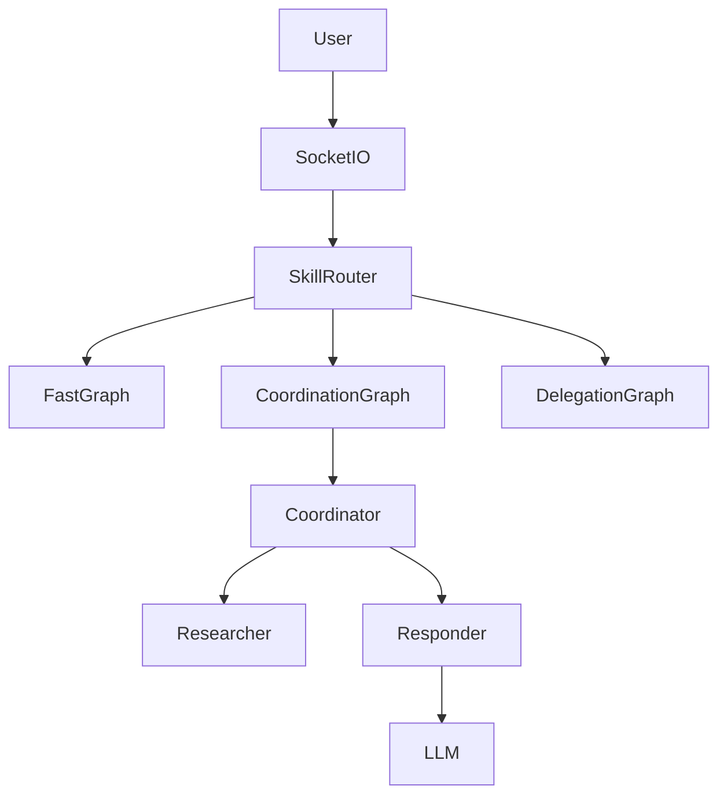

# karen-ai 开源跳槽路线图

> 目标：把 karen-ai 从"个人工具"打磨成**经得起面试官逐行 review**的开源作品集。
> 核心策略：**少做功能，多做深度**。一个能跑通的杀手级场景 > 十个半吊子功能。

---

## 项目定位（一句话）

**karen-ai 是一个支持智能模型路由、技能系统和 MCP 工具协议的开源多 Agent 协作框架。**

关键词：模型路由、技能系统、MCP、多 Agent 协作。这四个词全是 2024-2025 面试热点。

---

## Phase 1：代码硬实力（第 1-2 周）

### 目标
让代码质量达到"大厂开源项目"门槛。面试官 clone 下来，`pytest` 一键绿，`ruff` 零报错，没有脏文件。

### 任务清单

#### 1.1 修复审查报告（P0 → P1 → P2）
按优先级顺序修，不要跳着来：

- [ ] **P0-1** `core/auth.py`：默认管理员密码改为启动时随机生成并打印到控制台
- [ ] **P0-2** `tools/code_executor.py`：沙箱加固（至少加 seccomp，理想情况是 Docker 隔离）
- [ ] **P0-3** `web/app.py`：`FLASK_SECRET_KEY` 未设置时持久化到 `data/.secret_key`，而非每次随机
- [ ] **P1-1** `web/state.py`：`socket_states` / `socket_configs` 加硬上限（max 5000），超限 LRU 淘汰
- [ ] **P1-2** `agents/llm.py`：httpx client 缓存 key 加 loop 对象校验，防线程 ID 重用
- [ ] **P1-3** `graph/orchestrator.py`：删除废弃的 `create_multi_agent_graph`，或改名 `_deprecated_create_multi_agent_graph`
- [ ] **P1-4** `state/persistence.py`、`state/stats.py`、`core/cache.py`：SQLite 线程本地连接加 TTL（如 5 分钟无操作自动 close）
- [ ] **P2-1** `agents/search.py`：快速模式搜索超时从 1.5s 调到 3s，或前端发 `search_skipped` 事件
- [ ] **P2-2** `test_all.py`：废弃自定义装饰器，全面迁移到 pytest
- [ ] **P2-3** 补测试：认证流程（登录/越权）、LOCAL_ONLY 中间件、模型路由边界 case、消息顺序归一化

#### 1.2 引入工程规范
- [ ] 加 `ruff`（pyproject.toml 配置）
- [ ] 加 `mypy`（先覆盖 `agents/`、`graph/`、`core/`、`web/`）
- [ ] GitHub Actions CI：push/PR 时自动跑 `pytest` + `ruff check .` + `mypy`
- [ ] 清理 git 历史：`git filter-repo` 删掉所有 `.db`、`.pyc`、临时文件
- [ ] 完善 `.gitignore`：加 `data/*.db`、`__pycache__/`、`*.spec`、`.app.lock`

#### 1.3 依赖管理
- [ ] `requirements.txt` 加版本上限（如 `flask>=3.0.0,<4.0.0`）
- [ ] 或迁移到 `pyproject.toml`（现代 Python 项目标准）

### 验收标准
```bash
git clone <your-repo>
cd karen-ai
pip install -r requirements.txt
pytest          # 全部通过
ruff check .    # 零报错
mypy agents/ graph/ core/ web/  # 零报错
```

### 面试话术
> "这个项目我维护了完整的测试和类型检查，CI 里跑了 pytest + ruff + mypy，保证代码质量。"

---

## Phase 2：架构叙事（第 3-4 周）

### 目标
写好文档，让面试官 5 分钟看懂架构设计，同时帮你准备面试答案。

### 任务清单

#### 2.1 ARCHITECTURE.md（核心文档）
必须回答这几个问题：

```markdown
# 架构设计

## 1. 为什么用 LangGraph？
- 状态机比串行调用更易扩展
- 节点间通过共享 state 通信，解耦各 Agent

## 2. 三种执行模式的 Trade-off
| 模式 | 延迟 | 质量 | 适用场景 |
|------|------|------|----------|
| Fast | <2s | 中 | 日常问答 |
| Coordination | 3-5s | 高 | 需要研究的问题 |
| Review | 5-10s | 最高 | 代码/重要内容 |

## 3. 消息顺序问题（踩坑记录）
- LangGraph 的 `add` reducer 按完成时序追加消息
- 并行搜索导致 SystemMessage 位置乱序
- 解决：`_normalize_message_order()` + `_reorder_system_first()`

## 4. 模型路由设计
- 不用 LLM 判断（省一次调用、省 1-2s）
- 用预编译正则 + 权重评分，0ms 完成路由
- 编码意图严格过滤（防 powerful 模型返回空响应）

## 5. Socket 级配置隔离
- 全局字典 `socket_configs[sid]` 存储每个连接的配置
- 为什么不用全局单例：支持多用户同时使用不同模型/API Key
- 清理策略：disconnect 时清理 + 每 10 分钟扫描不活跃连接

## 6. 安全设计
- LOCAL_ONLY 路由：敏感接口仅本机访问
- TRUST_PROXY：默认不信任，防 X-Forwarded-For 伪造
- 代码执行：AST 扫描 + 子进程隔离 + 默认关闭
```

#### 2.2 PERFORMANCE.md
跑 benchmark，有数字才有说服力：

```markdown
| 测试项 | Fast 模式 | Coordination 模式 | 节省 |
|--------|-----------|-------------------|------|
| 简单问候 | 0.8s | 2.1s | -62% |
| 事实查询 | 1.5s | 4.2s | -64% |
| 代码请求 | 1.2s | 3.8s | -68% |

意图分类跳过搜索后平均节省 1.5s
```

#### 2.3 CONTRIBUTING.md
- 环境搭建（Windows/WSL/Mac）
- 怎么跑测试
- 怎么提 PR（分支命名、commit 规范）

### 验收标准
- 陌生人 clone 项目后，看完 ARCHITECTURE.md 能画出系统架构图
- 所有设计决策都有"为什么"，不只是"做了什么"

### 面试话术
> "我在项目里写了一篇 ARCHITECTURE.md，记录了每个设计决策的 trade-off。比如模型路由我选了正则权重而不是 LLM 判断，因为省一次调用能少 1-2 秒延迟。"

---

## Phase 3：技能系统 + MCP（第 5-7 周）

### 目标
这是"像 Hermes"的核心，也是技术深度最深的部分。让 karen-ai 从"聊天机器人"变成"能执行任务的 Agent"。

### 任务清单

#### 3.1 技能系统（Skills）
新建目录结构：
```
skills/
├── __init__.py
├── loader.py          # 自动扫描并加载技能
├── base.py            # Skill 基类
├── code_review/       # 代码审查技能
│   ├── SKILL.md       # prompt + 工具清单 + 验收标准
│   └── prompt.py      # 具体 prompt 模板
├── debug/
│   ├── SKILL.md
│   └── prompt.py
└── refactor/
    ├── SKILL.md
    └── prompt.py
```

每个 SKILL.md 格式：
```markdown
---
name: code-review
trigger: ["review", "审查", "code review"]
tools: [file_read, terminal, web_search]
---

# 代码审查技能

## 流程
1. 读取目标文件
2. spawn 3 个子 agent 并行审查（安全/性能/风格）
3. 汇总输出结构化报告

## 验收标准
- 必须覆盖所有 .py 文件
- 必须按 P0/P1/P2/P3 分级
```

实现要点：
- [ ] `skills/loader.py`：根据用户输入关键词匹配技能（正则/语义匹配）
- [ ] `skills/base.py`：定义 `Skill` 基类，有 `can_handle(query)` 和 `execute(context)` 方法
- [ ] 先实现 **code-review** 技能（你现在就在用的这套审查流程）
- [ ] 接入 `agents/nodes.py`，在 responder 之前加一道 skill routing

#### 3.2 MCP 工具统一层
- [ ] 把所有内置工具（web_search、file_read、terminal）封装成 MCP Server
- [ ] 主 Agent 通过 `mcp` 库调用，不再直接 import 函数
- [ ] 配置文件 `mcp_config.json`：
```json
{
  "servers": [
    {"name": "search", "type": "stdio", "command": "python -m mcp_servers.search"},
    {"name": "terminal", "type": "stdio", "command": "python -m mcp_servers.terminal"}
  ]
}
```

#### 3.3 热加载
- [ ] 技能文件修改后无需重启服务，自动重新加载
- [ ] MCP server 配置修改后自动重连

### 验收标准
- 用户输入"审查这个项目"，自动触发 code-review 技能
- 新增一个技能只需在 skills/ 下新建目录，核心代码零改动
- 新增一个工具只需改 mcp_config.json

### 面试话术
> "我设计了一套技能系统，类似 VS Code 的插件机制。Agent 根据用户输入自动匹配技能，每个技能有自己的 prompt 模板和工具集。工具层我接的是 MCP 协议，加新工具只需要改配置。"

---

## Phase 4：子 Agent 委派（第 8-9 周）

### 目标
展示**并发控制**和**任务分解**能力。复杂任务不再一个 agent 硬扛。

### 任务清单

#### 4.1 子 Agent 并行执行
- [ ] 在 `graph/orchestrator.py` 新增 `create_delegation_graph`
- [ ] Coordinator 识别复杂任务后，拆分子任务列表
- [ ] 每个子任务 spawn 独立 `CompiledStateGraph` 实例
- [ ] 用 `asyncio.gather` 并行跑，统一超时控制
- [ ] 结果汇总节点做冲突消解（如两个子 agent 意见矛盾时怎么办）

#### 4.2 具体场景：代码审查
```
用户：审查 /mnt/e/Agent-Eval
↓
Coordinator 识别为 code-review 技能
↓
拆分为 3 个子任务：
  - 安全审查（检查 SQL 注入、XSS、命令注入）
  - 性能审查（检查 N+1 查询、内存泄漏、异步阻塞）
  - 风格审查（检查类型安全、命名规范、重复代码）
↓
并行执行（各 30 秒超时）
↓
汇总节点合并报告，去重并标记冲突
↓
输出 Markdown 报告
```

### 验收标准
- 审查 Agent-Eval 项目能在 30 秒内出结构化报告
- 子 agent 超时后不影响其他子 agent 的结果
- 汇总报告有"共识项"和"争议项"两个区块

### 面试话术
> "复杂任务我会拆成子任务并行处理。比如代码审查，我会 spawn 三个独立 agent 分别看安全、性能和风格，每个有自己的工具集和超时控制。最后做结果归并，如果两个 agent 意见矛盾会标出来让用户判断。"

---

## Phase 5：开源包装（第 10-11 周）

### 目标
让项目看起来像"正经开源项目"，不是玩具。

### 任务清单

#### 5.1 README.md 重写
结构必须包含：

```markdown
# karen-ai

> 支持智能模型路由、技能系统和 MCP 工具协议的开源多 Agent 协作框架

[这里放一张架构图或 Demo GIF]

## 核心特性

- **三种执行模式**：Fast / Coordination / Review，按场景权衡延迟与质量
- **智能模型路由**：0ms 正则权重评分，自动切换 light/default/powerful 档位
- **意图识别优化**：双层规则引擎，跳过不必要的搜索，平均节省 1.5s
- **Socket 级配置隔离**：多用户同时使用不同模型和 API Key
- **技能系统**：可插拔 Skill，支持热加载
- **MCP 工具协议**：工具即服务，配置化接入
- **代码执行沙箱**：AST 静态扫描 + 子进程隔离

## 一键启动

```bash
pip install -r requirements.txt
python web/app.py
```

或 Docker：

```bash
docker-compose up
```

## 架构图



## 文档

- [架构设计](ARCHITECTURE.md)
- [性能报告](PERFORMANCE.md)
- [贡献指南](CONTRIBUTING.md)

## License

MIT
```

#### 5.2 其他文件
- [ ] `LICENSE`（MIT）
- [ ] `.github/workflows/ci.yml`（pytest + ruff + mypy）
- [ ] `.github/ISSUE_TEMPLATE/bug_report.md`
- [ ] `.github/pull_request_template.md`
- [ ] `docker-compose.yml`（Flask + SQLite 卷挂载）
- [ ] `Dockerfile`

#### 5.3 Demo 素材
- [ ] 录一个 2 分钟 GIF：上传项目 → 自动审查 → 出报告
- [ ] 截图：Web UI 界面、配置页面、审查报告样式

### 验收标准
- 陌生人 5 分钟以内能跑起来
- README 看完 30 秒知道这项目干嘛的
- GitHub 页面有绿勾勾 CI badge

---

## Phase 6：评测与背书（第 12 周起，持续）

### 目标
让项目有外部验证，不只是自嗨。

### 任务清单

#### 6.1 用 Agent-Eval 评测 karen-ai
- [ ] 定义评测维度：响应准确率、工具调用成功率、平均延迟
- [ ] 跑 Fast / Coordination / Review 三种模式的 benchmark
- [ ] 生成报告，放在 `benchmarks/` 目录
- [ ] README 引用这些数据

#### 6.2 技术博客（3 篇）

**第一篇：架构设计**
- 标题：《我用 LangGraph 搭建了一个支持模型路由的多 Agent 系统》
- 内容：三种模式的 trade-off、消息顺序问题的解决、为什么不用 LLM 做路由
- 平台：知乎/掘金/个人博客

**第二篇：技能系统**
- 标题：《给 LLM Agent 加一个技能系统》
- 内容：Skill 的设计、加载机制、和 MCP 的协同

**第三篇：安全设计**
- 标题：《Agent 代码执行沙箱的设计与局限》
- 内容：AST 扫描、子进程隔离、为什么还不能完全防逃逸、未来的 Docker 隔离方案

#### 6.3 传播
- [ ] v2xex 发帖："开源了一个类 Hermes 的多 Agent 框架"
- [ ] 推特/朋友圈发架构图
- [ ] 让朋友帮忙 star，目标 50+ star（能写进简历）

### 面试话术
> "这个项目我用自己写的评测框架做了 benchmark，Fast 模式平均响应 1.2s，Coordination 模式准确率比单 Agent 高 15%。我还写了三篇技术博客讲架构设计，发在知乎上。"

---

## 执行节奏建议

**不要并行做多个 Phase。** 按顺序来，每完成一个 Phase 就有一个能演示的版本。

| 周次 | Phase | 产出物 |
|------|-------|--------|
| 1-2 | Phase 1 | 代码修复 + CI 绿勾 |
| 3-4 | Phase 2 | ARCHITECTURE.md + 性能报告 |
| 5-7 | Phase 3 | 技能系统 + MCP 接入 |
| 8-9 | Phase 4 | 子 Agent 委派 + 代码审查 Demo |
| 10-11 | Phase 5 | README + Docker + 录 Demo |
| 12+ | Phase 6 | 博客 + 传播 |

**每周五的检查点：**
1. `pytest` 还能不能一键通过？
2. 这周改的东西有没有写进 ARCHITECTURE.md？
3. 能不能给面试官演示这周的新功能？

---

## 杀手级演示场景（务必先做通这个）

**"帮我审查这个项目"**

```
用户：审查 /mnt/e/Agent-Eval/src
↓
karen-ai 自动：
1. 识别意图 → 加载 code-review 技能
2. 扫描目录结构 → 找出所有 .ts 文件
3. Spawn 3 个子 agent 并行审查
4. 30 秒内输出 Markdown 报告（P0/P1/P2/P3 分级）
```

**这是面试时的核武器。** 你只需要打开浏览器，上传一个项目，等 30 秒，一份专业报告出来了。面试官会记住你。

把这个流程录成 2 分钟 GIF，放在 README 最上面。

---

## 附：和 Hermes 的能力对比（改造后）

| 能力 | Hermes | karen-ai 改造后 |
|------|--------|-----------------|
| 持久记忆 | ✅ | ✅（SQLite + Qdrant） |
| 技能系统 | ✅ | ✅（skills/ 目录） |
| MCP 工具 | ✅ | ✅（mcp_config.json） |
| 子 Agent 委派 | ✅ | ✅（Delegation Graph） |
| 终端能力 | ✅ | ⚠️（先只做只读命令） |
| 浏览器能力 | ✅ | ❌（Phase 3 之后可选做） |
| 代码审查 | ✅ | ✅（杀手级场景） |

**改造后的 karen-ai 就是 Hermes 的 80%，但代码全开源、架构全透明。**

---

*这份大纲可以直接保存，每周对照打钩执行。*
